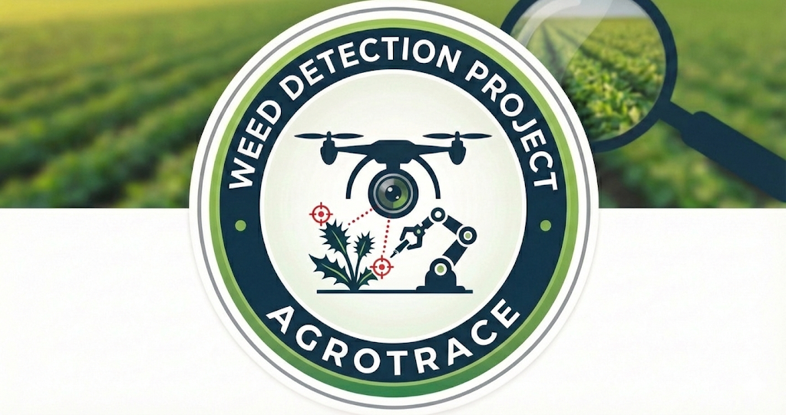

# AgroTrace 🚜🌾

**AI-Powered Weed Detection & Blockchain-Enabled Crop Traceability Platform**

AgroTrace is a full-stack web application designed to empower farmers with precision agriculture tools. It combines **YOLOv8** for real-time weed detection with a **Blockchain-ready** data structure to ensure immutable traceability of crop health, herbicide usage, and farming practices.



## 🌟 Key Features

*   **🌾 Land Registration**: Register farmland and auto-generate unique **QR Code Identities** for physical land parcels.
*   **🌿 AI Weed Detection**:
    *   **Live Webcam**: Real-time inference using YOLOv8 models.
    *   **Video Upload**: Process prerecorded farm videos for weed analysis.
*   **🔗 Blockchain Traceability**: A simulated blockchain ledger ensures that every detection and treatment record is hashed and linked, providing a tamper-proof history.
*   **📊 Farmer Dashboard**: View timeline history of detections, chemical usage, and crop status by scanning the Land ID.

## 🛠️ Technology Stack

*   **Frontend**: React.js, Tailwind CSS, Lucide Icons, Axios.
*   **Backend**: Flask (Python), SQLAlchemy.
*   **AI/ML**: YOLOv8 (Ultralytics), OpenCV, NumPy.
*   **Database**: SQLite (with Blockchain-ready schema: `prev_hash`, `tx_hash`).
*   **Tools**: QR Code generation, Vite.

## 🚀 Getting Started

Follow these steps to set up the project locally.

### Prerequisites
*   Node.js & npm
*   Python 3.8+

### 1. Backend Setup (Flask API)

Navigate to the project root:
```bash
cd backend
```

Install dependencies:
```bash
pip install -r requirements.txt
```

Run the server:
```bash
python app.py
```
*The API will start at `http://localhost:5000`*

### 2. Frontend Setup (React UI)

Open a new terminal and navigate to the frontend folder:
```bash
cd frontend
```

Install dependencies:
```bash
npm install
```

Run the development server:
```bash
npm run dev
```
*The UI will run at `http://localhost:5173`*

## 📖 Usage Guide

1.  **Register Land**: Go to the "Register" page. Enter crop details. A QR code is generated. **Copy the Land ID**.
2.  **Detect Weeds**:
    *   Go to "Weed Detection".
    *   Enter the Land ID.
    *   Select "Live Webcam" or "Upload Video".
    *   See real-time bounding boxes and weed counts.
3.  **Store on Blockchain**: After detection, click **"Commit to Blockchain"** to generate a transaction hash.
4.  **View History**: Go to "Dashboard", enter the Land ID, and see the timeline of verified events.

## 🔮 Future Roadmap

*   [ ] Deploy Smart Contracts to Ethereum/Polygon.
*   [ ] Integration with IoT Sprayers.
*   [ ] Mobile App (React Native).
*   [ ] Weather API Integration.

---
Built for the Future of Agriculture.
